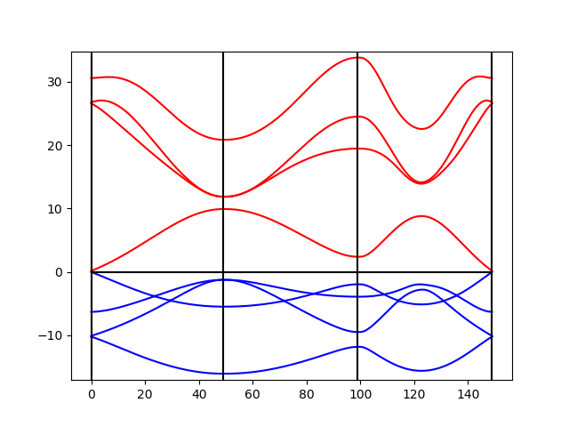

# pyBand

Band Structure Calculations with Extended Huckel

## Installation

To install pyBand, clone the repository in a local folder and cd into it
Then use pip to install the module

```
pip install ./
```

## Example : graphene

To compute the band structure of graphene you need two files. An input file describing the system and the K-points you want and anotherfile containing the Huckel parameters. The input file here looks like

```
TITLE graphene

ATOMS
C	0.0  0.00 	0.00					
C   1.23 0.71   0.00
END

LATTICE
 1.23 -2.130422493309719 
 1.23  2.130422493309719 
END

KMESH 50

BZPATH
-0.66  0.33 0.
0.00 0.00	0.
0.50 0.00 0.0
-0.66  0.33 0.
END
```

We here specify the atom types and positions, the lattice vectors, the number of k-points, and the path in Brillouin zone. To computation of the band structure is then done following

```python
import pyBand

# create the class instance
bs = pyBand.BandStructure('graphene.in','parameters')

# compute the electronic structure of the system
bs.electronic_structure()

# compute the bands
bs.compute_bands()

# pickle the results
bs.pickle()

# plot the bands
bs.plot_bands()

```

This will produce the following figure




